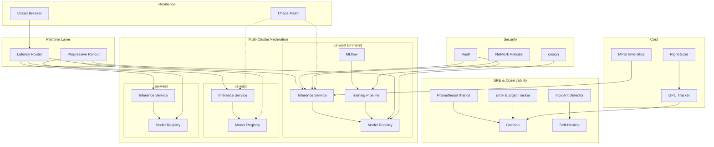

# Week 14: Phase B Consolidation

## Context

**Where it fits:** Phase B, Week 14 — the final week, integrating and documenting everything from Weeks 8-13.
**Prerequisites:** All of Phase B (Weeks 8-13) complete: SRE practices, cost optimization, security, chaos engineering, multi-cluster federation, ML lifecycle management.
**What it builds on:** Each previous week built an independent capability. This week proves they all work together as a cohesive system. You'll run a full lifecycle integration test, write a portfolio blog post, conduct a security audit, document decisions as ADRs, and create architecture diagrams.

This is the "ship it" week. By the end, your Anvil AI Infrastructure project should be portfolio-ready with documentation that demonstrates senior-level systems thinking.

---

## Learning Goals

- [ ] Validate that independently-built components integrate correctly end-to-end
- [ ] Write technical content that demonstrates depth (blog post format)
- [ ] Conduct security audits against established security baselines
- [ ] Document architectural decisions with proper ADR format
- [ ] Create clear infrastructure architecture diagrams
- [ ] Build a resilience summary that quantifies system reliability

---

## Implementation Goals

- [ ] Execute full lifecycle integration test: train → evaluate → promote → deploy → monitor → rollback
- [ ] Write blog post: "Building Reliable AI Infrastructure: SRE, Security, and Cost at Scale"
- [ ] Conduct security audit of the entire system against Week 10 baselines
- [ ] Write 5+ Architecture Decision Records (ADRs) for key Phase B decisions
- [ ] Update portfolio README with infrastructure architecture diagrams (Mermaid)
- [ ] Create resilience summary document aggregating all chaos experiment results
- [ ] Record a demo script showing the complete system in action
- [ ] Fix any integration issues discovered during end-to-end testing

---

## Acceptance Criteria

1. Integration test passes end-to-end: model trained, evaluated (score > threshold), promoted through all stages, deployed to multi-cluster, monitored, and successfully rolled back on trigger
2. Blog post is 2000-3000 words with architecture diagrams, code snippets, and measurable results
3. Security audit report covers: secrets management, network policies, RBAC, supply chain, with pass/fail for each control
4. At least 5 ADRs are written covering: SLO targets, chaos strategy, multi-cluster approach, model lifecycle gates, and cost attribution method
5. README includes Mermaid architecture diagram showing all components and their relationships
6. Resilience summary shows pass rate across all chaos experiments with mean recovery time
7. No critical security findings remain unresolved from the audit
8. All Grafana dashboards load correctly and show data from the past 7 days
9. Demo script can be executed by a cold reader and produces expected results
10. Portfolio repository has clean git history with meaningful commit messages for each week

---

## Validation Commands

```bash
# Run full lifecycle integration test
kubectl apply -f tests/phase-b-integration.yaml -n mlops && \
  kubectl wait --for=condition=complete job/phase-b-e2e -n mlops --timeout=1800s && \
  kubectl logs job/phase-b-e2e -n mlops | tail -20

# Verify all components are healthy
for ns in inference training monitoring sre cost security mlops federation; do
  echo "=== $ns ===" && kubectl get pods -n $ns | grep -v Running | grep -v Completed
done

# Run security audit
kubectl apply -f audits/security-scan.yaml -n security && \
  kubectl wait --for=condition=complete job/security-audit -n security --timeout=300s && \
  kubectl logs job/security-audit -n security | jq '.summary'

# Verify ADRs exist
ls docs/adrs/ | wc -l  # Should be >= 5

# Check blog post word count
wc -w docs/blog/reliable-ai-infrastructure.md  # Should be 2000-3000

# Verify architecture diagrams render
cat README.md | grep -c "```mermaid"  # Should be >= 1

# Verify resilience summary
cat reports/resilience-summary.json | jq '{pass_rate: .pass_rate, mean_recovery_seconds: .mean_recovery_seconds}'

# Run demo script (dry run)
bash scripts/demo.sh --dry-run

# Check Grafana dashboards
curl -s http://grafana.monitoring:3000/api/search | jq '.[].title' | wc -l

# Verify git history
git log --oneline --since="8 weeks ago" | wc -l  # Should show commits for each week
```

---

## Technical Implementation Details

### Full Lifecycle Integration Test

```yaml
# File: tests/phase-b-integration.yaml
apiVersion: batch/v1
kind: Job
metadata:
  name: phase-b-e2e
  namespace: mlops
spec:
  backoffLimit: 1
  template:
    spec:
      serviceAccountName: e2e-test-runner
      containers:
        - name: test
          image: anvil/e2e-test:latest
          env:
            - name: MLFLOW_TRACKING_URI
              value: "http://mlflow.mlops:5000"
            - name: INFERENCE_GATEWAY
              value: "http://inference-gateway.inference:8080"
            - name: PROMETHEUS_URL
              value: "http://prometheus.monitoring:9090"
          command:
            - python
            - -u
            - /tests/full_lifecycle.py
      restartPolicy: Never
```

```python
# File: tests/full_lifecycle.py
"""
Phase B Integration Test: Full ML Lifecycle
train → evaluate → promote → deploy → monitor → A/B test → rollback → fix → redeploy
"""
import time
import requests
import mlflow
from src.lifecycle.promoter import ModelPromoter
from src.lifecycle.ab_testing import ABTestRunner, ABTestConfig

def main():
    print("=" * 60)
    print("PHASE B INTEGRATION TEST: Full ML Lifecycle")
    print("=" * 60)

    # Step 1: Train model
    print("\n[1/8] Training model...")
    with mlflow.start_run(run_name="integration-test-v1") as run:
        mlflow.log_params({"learning_rate": 0.001, "epochs": 5, "batch_size": 32})
        for epoch in range(5):
            loss = 1.0 / (epoch + 1)
            mlflow.log_metric("loss", loss, step=epoch)
        mlflow.log_metric("eval_score", 0.91)
        mlflow.pytorch.log_model(model, "model")
    print(f"   Run ID: {run.info.run_id}")

    # Step 2: Evaluate
    print("\n[2/8] Evaluating model...")
    eval_score = evaluate_model(run.info.run_id)
    assert eval_score > 0.85, f"Eval score {eval_score} below threshold"
    print(f"   Eval score: {eval_score:.3f} (threshold: 0.85) ✓")

    # Step 3: Promote to staging
    print("\n[3/8] Promoting to staging...")
    promoter = ModelPromoter()
    result = promoter.promote("integration-test-model", "candidate", "staging")
    assert result["status"] == "promoted", f"Promotion failed: {result}"
    print(f"   Promoted to staging ✓")

    # Step 4: Deploy to inference cluster
    print("\n[4/8] Deploying to inference...")
    deploy_result = deploy_model("integration-test-model", "staging")
    assert deploy_result["ready"], "Deployment not ready"
    time.sleep(30)  # Wait for rollout
    print(f"   Deployed and serving ✓")

    # Step 5: Monitor (verify SLI metrics flowing)
    print("\n[5/8] Verifying monitoring...")
    metrics = check_metrics("integration-test-model")
    assert metrics["availability"] > 0.99, "Availability below threshold"
    print(f"   Availability: {metrics['availability']:.4f} ✓")

    # Step 6: A/B test
    print("\n[6/8] Running A/B test...")
    ab_config = ABTestConfig(
        name="integration-ab-test",
        production_model="production-v1",
        candidate_model="integration-test-model",
        traffic_percent_candidate=10,
        min_samples=100,
    )
    ab_runner = ABTestRunner(ab_config)
    for _ in range(200):
        model = ab_runner.route_request()
        latency = send_request(model)
        ab_runner.record_result(model, latency, is_error=False)
    comparison = ab_runner.get_comparison()
    print(f"   A/B results: {comparison}")

    # Step 7: Simulate bad model and rollback
    print("\n[7/8] Testing rollback...")
    deploy_bad_model()
    time.sleep(60)
    rollback_triggered = check_rollback_occurred()
    assert rollback_triggered, "Rollback should have triggered"
    print(f"   Automatic rollback triggered ✓")

    # Step 8: Verify recovery
    print("\n[8/8] Verifying recovery...")
    time.sleep(30)
    current_model = get_serving_model()
    assert current_model == "production-v1", f"Expected production-v1, got {current_model}"
    print(f"   Serving production model after rollback ✓")

    print("\n" + "=" * 60)
    print("ALL TESTS PASSED - Phase B Integration Complete")
    print("=" * 60)

if __name__ == "__main__":
    main()
```

### Blog Post Structure

```markdown
# File: docs/blog/reliable-ai-infrastructure.md
# Building Reliable AI Infrastructure: SRE, Security, and Cost at Scale

## Introduction
[Why AI infrastructure is different from traditional infrastructure - GPU costs, model lifecycle, non-determinism]

## Architecture Overview
[Mermaid diagram of the full system]

## SRE for AI: Beyond Traditional SLOs
- Why inference latency p99 matters more than mean
- Error budgets that account for model degradation
- Self-healing that understands GPU failure modes
[Code snippet: SLO definition and error budget calculation]

## Cost Optimization: Making GPUs Pay for Themselves
- MPS vs time-slicing benchmark results
- The preemption handler that saves training jobs
- Right-sizing: "your model only uses 30% of that GPU"
[Graph: before/after cost comparison]

## Security: Protecting the Model Supply Chain
- Vault for secrets, cosign for models
- NetworkPolicies that actually work
- Break-glass: because sometimes you need to move fast
[Diagram: supply chain flow]

## Chaos Engineering: Breaking Things on Purpose
- The gameday that found our biggest weakness
- Resilience scorecard: quantifying reliability
- Circuit breakers for graceful degradation
[Table: experiment results]

## Multi-Cluster: Simulating Global Scale
- Progressive rollouts across regions
- Latency-based routing
- Failover that actually works under load
[Diagram: multi-cluster topology]

## ML Lifecycle: From Experiment to Production
- The promotion gate that saved us from a bad deploy
- A/B testing with statistical rigor
- Data versioning: reproducibility matters
[Code snippet: promotion gate]

## Results
- [Metric]: X% improvement in [thing]
- [Metric]: Reduced recovery time from Xm to Ys
- [Metric]: Cost reduction of Z%

## Lessons Learned
[5-7 key takeaways]

## What's Next
[Phase C preview]
```

### ADR Template

```markdown
# File: docs/adrs/000-template.md
# ADR-NNN: [Title]

## Status
[Proposed | Accepted | Deprecated | Superseded by ADR-XXX]

## Context
[What is the issue that we're seeing that is motivating this decision?]

## Decision
[What is the change that we're proposing and/or doing?]

## Consequences
### Positive
- [benefit]

### Negative
- [trade-off]

### Neutral
- [observation]

## Alternatives Considered
| Option | Pros | Cons | Decision |
|--------|------|------|----------|
| [A] | [pros] | [cons] | Rejected |
| [B] | [pros] | [cons] | **Accepted** |
```

```markdown
# File: docs/adrs/001-slo-targets.md
# ADR-001: SLO Targets for AI Services

## Status
Accepted

## Context
AI inference services have different reliability characteristics than traditional web services.
GPU failures are more common, cold starts are slower, and model updates can cause subtle degradation.
We need to set SLO targets that balance reliability with development velocity.

## Decision
- Inference availability: 99.9% (allows ~43 minutes downtime/month)
- Inference latency p99: 500ms
- Training completion rate: 95% (failures are expected and retryable)
- GPU utilization target: 60% minimum (below this, we're wasting resources)

Error budget: 0.1% failure budget per 30-day rolling window.
When budget drops below 25%, trigger deployment freeze.

## Consequences
### Positive
- Clear target for all engineering decisions
- Error budget creates natural tension between reliability and velocity
- Training SLO acknowledges that failures are normal

### Negative
- 99.9% is aggressive for a team of one; may need to relax during development phases
- GPU utilization target may conflict with latency SLO during spike traffic

### Neutral
- These targets will be reviewed quarterly based on actual performance data
```

### Architecture Diagram (Mermaid)

```markdown
# For README.md

```

### Resilience Summary Document

```python
# File: scripts/generate-resilience-summary.py
import json
from pathlib import Path

def generate_summary():
    scorecard_path = Path("reports/resilience-scorecard.json")
    with open(scorecard_path) as f:
        scorecard = json.load(f)

    experiments = scorecard["experiments"]
    summary = {
        "phase": "B",
        "total_experiments": len(experiments),
        "pass_rate": sum(1 for e in experiments if e["passed"]) / len(experiments),
        "mean_detection_seconds": sum(e["detected_in_seconds"] for e in experiments) / len(experiments),
        "mean_recovery_seconds": sum(e["recovered_in_seconds"] for e in experiments) / len(experiments),
        "data_loss_incidents": sum(1 for e in experiments if e["data_loss"]),
        "worst_availability_impact_pct": max(e["availability_impact_pct"] for e in experiments),
        "fixes_applied": [e["fix_applied"] for e in experiments if e.get("fix_applied")],
        "by_category": {},
    }

    for e in experiments:
        cat = e["chaos_type"]
        if cat not in summary["by_category"]:
            summary["by_category"][cat] = {"total": 0, "passed": 0}
        summary["by_category"][cat]["total"] += 1
        if e["passed"]:
            summary["by_category"][cat]["passed"] += 1

    output_path = Path("reports/resilience-summary.json")
    with open(output_path, "w") as f:
        json.dump(summary, f, indent=2)

    print(f"Resilience Summary:")
    print(f"  Pass rate: {summary['pass_rate']*100:.0f}%")
    print(f"  Mean detection: {summary['mean_detection_seconds']:.0f}s")
    print(f"  Mean recovery: {summary['mean_recovery_seconds']:.0f}s")
    print(f"  Data loss incidents: {summary['data_loss_incidents']}")
    return summary

if __name__ == "__main__":
    generate_summary()
```

### Security Audit Checklist

```yaml
# File: audits/security-checklist.yaml
audit:
  date: "YYYY-MM-DD"
  auditor: "your-name"
  scope: "Full Phase B infrastructure"

controls:
  secrets_management:
    - check: "All secrets stored in Vault (not ConfigMaps)"
      command: "kubectl get secrets -A -o json | jq '.items[] | select(.type==\"Opaque\") | .metadata.name'"
      pass_criteria: "No application secrets in native K8s secrets"
      status: null  # pass/fail

    - check: "Secret rotation configured and working"
      command: "kubectl logs -n vault -l app=secret-rotator --since=25h | grep 'rotation_complete'"
      pass_criteria: "At least one rotation in last 24h"
      status: null

  network_security:
    - check: "Default deny NetworkPolicy in all namespaces"
      command: "for ns in inference training mlops; do kubectl get netpol -n $ns | grep default-deny; done"
      pass_criteria: "All namespaces have default-deny"
      status: null

    - check: "Cross-namespace traffic blocked"
      command: "kubectl run test --rm -it --image=busybox -n default -- wget -qO- --timeout=3 http://mlflow.mlops:5000"
      pass_criteria: "Connection timeout/refused"
      status: null

  pod_security:
    - check: "Restricted PSS enforced"
      command: "kubectl get ns -o json | jq '.items[] | {name: .metadata.name, pss: .metadata.labels[\"pod-security.kubernetes.io/enforce\"]}'"
      pass_criteria: "All non-system namespaces have 'restricted'"
      status: null

  supply_chain:
    - check: "All model images signed"
      command: "cosign verify --key k8s://cosign-system/cosign-key registry.local:5000/models/production-v1:latest"
      pass_criteria: "Verification succeeds"
      status: null

    - check: "No critical CVEs in running images"
      command: "grype $(kubectl get pods -n inference -o jsonpath='{.items[0].spec.containers[0].image}') --fail-on critical"
      pass_criteria: "Exit code 0"
      status: null

  rbac:
    - check: "Team isolation enforced"
      command: "kubectl auth can-i get pods -n data-eng --as=system:serviceaccount:ml-team:ml-deployer"
      pass_criteria: "no"
      status: null

  audit_logging:
    - check: "All deployments logged"
      command: "kubectl logs -n audit -l app=audit-logger --since=1h | jq 'select(.verb==\"create\")' | head"
      pass_criteria: "Logs present with user, resource, timestamp"
      status: null
```

### Demo Script

```bash
# File: scripts/demo.sh
#!/bin/bash
set -euo pipefail

DRY_RUN=${1:-""}

echo "╔══════════════════════════════════════════════════╗"
echo "║  Anvil AI Infrastructure - Phase B Demo         ║"
echo "╚══════════════════════════════════════════════════╝"

step() {
  echo ""
  echo "━━━━━━━━━━━━━━━━━━━━━━━━━━━━━━━━━━━━━━━"
  echo "STEP: $1"
  echo "━━━━━━━━━━━━━━━━━━━━━━━━━━━━━━━━━━━━━━━"
  if [[ "$DRY_RUN" == "--dry-run" ]]; then
    echo "[DRY RUN] Would execute: $2"
    return
  fi
}

step "1. Show cluster health" \
  "kubectl get nodes && kubectl get pods -A | grep -v Running"

step "2. Show SLO dashboard" \
  "curl -s http://grafana:3000/api/dashboards/uid/slo-overview | jq '.dashboard.title'"

step "3. Train a model" \
  "kubectl apply -f demos/training-job.yaml && kubectl wait --for=condition=complete job/demo-train -n mlops --timeout=300s"

step "4. Show experiment in MLflow" \
  "curl -s http://mlflow.mlops:5000/api/2.0/mlflow/runs/search -d '{\"experiment_ids\":[\"1\"]}' | jq '.runs[0].data.params'"

step "5. Promote model through gates" \
  "python -c 'from src.lifecycle.promoter import ModelPromoter; print(ModelPromoter().promote(\"demo-model\", \"candidate\", \"staging\"))'"

step "6. Deploy across clusters" \
  "kubectl apply -f demos/progressive-rollout.yaml"

step "7. Show cost dashboard" \
  "curl -s http://cost-service.cost:8080/api/v1/costs/summary | jq '.'"

step "8. Inject chaos and observe recovery" \
  "kubectl apply -f chaos/experiments/gpu-failure.yaml && sleep 60 && kubectl get pods -n inference"

step "9. Show security posture" \
  "kubectl apply -f audits/security-scan.yaml && kubectl logs job/security-audit -n security | jq '.summary'"

step "10. Show resilience scorecard" \
  "cat reports/resilience-summary.json | jq '{pass_rate, mean_recovery_seconds}'"

echo ""
echo "╔══════════════════════════════════════════════════╗"
echo "║  Demo Complete - All systems operational        ║"
echo "╚══════════════════════════════════════════════════╝"
```

---

## If You Get Stuck

| Problem | Solution |
|---------|----------|
| Integration test fails at model training step | Ensure GPU is available: `kubectl describe node | grep nvidia.com/gpu` |
| Integration test hangs at promotion | Check MLflow is accessible: `curl http://mlflow.mlops:5000/health` |
| Security audit finds unexpected secrets in ConfigMaps | Migrate them to Vault; update deployments to use Vault annotations |
| Mermaid diagram doesn't render | Use GitHub-flavored markdown preview; ensure code fence is `mermaid` not `text` |
| Blog post feels too shallow | Add specific numbers: latency improvements, cost savings, recovery times from your actual runs |
| Demo script fails on clean cluster | Add setup prerequisites check at the beginning of demo.sh |

---

## Agent Handoff Template

```
Resume Week 14: Phase B Consolidation.

Environment: ASUS ROG Strix SCAR 16, RTX 5080 16GB, 32GB RAM, Ubuntu.
K3s cluster: 3 multipass nodes (+ potential multi-cluster setup from Week 12).
All Phase B weeks (8-13) complete.

Current state: [describe what's done and what's next]

Tasks remaining:
- [ ] [list incomplete items from Implementation Goals]

Key files:
- tests/phase-b-integration.yaml
- tests/full_lifecycle.py
- docs/blog/reliable-ai-infrastructure.md
- docs/adrs/001-slo-targets.md (and 002-005)
- reports/resilience-summary.json
- audits/security-checklist.yaml
- scripts/demo.sh
- README.md (architecture diagram)

IMPORTANT: This is the consolidation week — do NOT build new features.
Focus on integration testing, documentation, and fixing gaps.
Blog post should be 2000-3000 words with real metrics from your runs.
ADRs should document WHY decisions were made, not just WHAT.
Validate with the validation commands in the spec.
```

---

## Out of Scope

- Phase C planning (that's a separate document)
- New feature development (consolidation only)
- Production deployment to cloud (this is a portfolio project)
- Video recording of demo (script is sufficient)
- Performance benchmarking against cloud services
- Comparison with other ML platforms (Kubeflow, SageMaker)
- User documentation (focus is on technical blog + ADRs)
