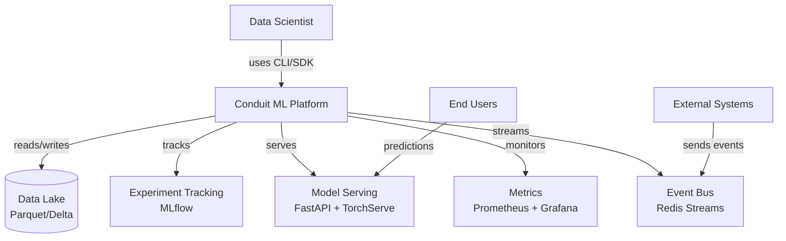

# Weeks 19-20: Portfolio Polish

## Context

**Where it fits:** Phase 3, Weeks 19-20 — Platform Maturity + Portfolio (final capstone)
**Prerequisites:** All prior weeks complete (Phases 1+2 infrastructure, Phase 3 Weeks 15-18 maturity features). The entire Conduit platform is operational.
**What it builds on:** Everything built over 18 weeks gets packaged into a professional portfolio: blog posts demonstrating depth, architecture docs showing system thinking, demo video proving it works end-to-end, benchmarks proving performance claims, and open-source release showing code quality.

**Hardware:** ASUS ROG Strix SCAR 16, RTX 5080 16GB, 32GB RAM, Ubuntu

---

## Learning Goals

- [ ] Understand technical blog writing: structure, audience, storytelling with code
- [ ] Learn architecture documentation standards: C4 model, arc42, decision records
- [ ] Study demo video production: scripting, screen recording, narration pacing
- [ ] Explore benchmarking methodology: reproducibility, statistical significance, fair comparisons
- [ ] Understand open-source release best practices: licensing, contribution guidelines, issue templates
- [ ] Learn ADR (Architecture Decision Record) format: context, decision, consequences
- [ ] Study competitive positioning: feature matrices, differentiation narratives

---

## Implementation Goals

- [ ] Write 4 technical blog posts (1500-2500 words each) with code examples and diagrams
- [ ] Create comprehensive architecture documentation with system diagrams and data flows
- [ ] Record 5-7 minute demo video showing full ML lifecycle
- [ ] Run and document benchmarks: pipeline throughput, training speed, inference latency, drift detection
- [ ] Write 5-7 ADRs covering key architectural decisions made throughout the project
- [ ] Prepare open-source release: clean repo, README, CONTRIBUTING.md, LICENSE, examples/
- [ ] Build comparison matrix: Conduit vs Vertex AI vs SageMaker vs Databricks MLflow
- [ ] Create portfolio landing page summarizing the project

---

## Acceptance Criteria

1. All 4 blog posts are complete, edited, technically accurate, include code snippets, and have at least one diagram each
2. Architecture documentation includes system context diagram, container diagram, component diagram, and data flow diagram (C4 model levels 1-3)
3. Demo video is 5-7 minutes, covers data ingestion → training → deployment → monitoring → drift → retraining cycle without cuts or errors
4. Benchmark report includes at least 5 measured metrics with methodology description, hardware specs, and comparison to baseline
5. Each ADR follows the standard format (Title, Status, Context, Decision, Consequences) and documents a non-trivial architectural choice
6. Open-source repository passes: `README` has quickstart, `CONTRIBUTING.md` has dev setup, `LICENSE` is MIT, `examples/` has 3+ runnable demos
7. Comparison matrix covers at least 15 feature dimensions with honest assessment (including where Conduit is weaker)
8. All documentation is spell-checked, code examples are tested and runnable, and links are valid
9. Portfolio landing page has project summary, architecture diagram, key metrics, links to blog posts, and link to GitHub repo
10. A cold reader (someone unfamiliar with the project) can clone the repo, follow the README, and have a working demo within 30 minutes

---

## Validation Commands

```bash
# Verify all blog posts exist and meet length requirements
for post in blog_post_{1..4}.md; do
  WORDS=$(wc -w < ~/conduit/docs/blog/$post)
  echo "$post: $WORDS words"
  [ $WORDS -ge 1500 ] && echo "  ✓ Meets minimum length" || echo "  ✗ Too short"
done

# Verify architecture docs
ls ~/conduit/docs/architecture/
# Expected: system-context.md, container-diagram.md, component-diagram.md, data-flow.md

# Check diagrams exist (Mermaid or PNG)
grep -l "```mermaid" ~/conduit/docs/architecture/*.md | wc -l

# Verify ADRs
ls ~/conduit/docs/adr/
for adr in ~/conduit/docs/adr/ADR-*.md; do
  echo "$(basename $adr):"
  grep -c "## Context\|## Decision\|## Consequences" "$adr"
done

# Run benchmarks and generate report
cd ~/conduit && python -m conduit.benchmarks.run_all \
  --output reports/benchmark_report.md
cat reports/benchmark_report.md | head -80

# Verify open-source readiness
ls ~/conduit/{README.md,CONTRIBUTING.md,LICENSE,examples/}
# Check examples are runnable
cd ~/conduit/examples/quickstart && python run.py --dry-run
cd ~/conduit/examples/fraud_detection && python run.py --dry-run
cd ~/conduit/examples/nlp_pipeline && python run.py --dry-run

# Spell check documentation
npx cspell "docs/**/*.md" --no-progress 2>&1 | tail -5

# Check for broken links
npx markdown-link-check docs/**/*.md 2>&1 | grep -c "ERROR"

# Build portfolio site
cd ~/conduit/docs && mkdocs build --strict
echo "Total pages: $(find site/ -name '*.html' | wc -l)"

# Verify comparison matrix
python -c "
import yaml
with open('docs/comparison_matrix.yaml') as f:
    matrix = yaml.safe_load(f)
features = matrix['features']
platforms = matrix['platforms']
print(f'Features compared: {len(features)}')
print(f'Platforms: {[p[\"name\"] for p in platforms]}')
assert len(features) >= 15
"

# Demo video script validation
wc -w ~/conduit/docs/demo/script.md
# Should be 800-1200 words for 5-7 min video
```

---

## Technical Implementation Details

### Blog Post Structure (Template)

```markdown
<!-- ~/conduit/docs/blog/blog_post_1.md -->
# Building an End-to-End ML Platform: Lessons from the Trenches

**Published:** June 2026  
**Reading time:** 10 minutes  
**Tags:** MLOps, Platform Engineering, Production ML

## The Problem

Most ML projects never make it to production. The gap between a notebook
that works on your laptop and a reliable production system is enormous...

## Architecture Overview

[Mermaid diagram: high-level system architecture]

## Key Design Decisions

### 1. Pipeline Orchestration: Why DAGs Beat Scripts

```python
# Instead of fragile shell scripts:
# run_training.sh → preprocess.py → train.py → evaluate.py → deploy.sh

# Declarative pipeline with dependency resolution:
pipeline = Pipeline("fraud_detection")
pipeline.add_stage("preprocess", PreprocessStage, depends_on=[])
pipeline.add_stage("train", TrainStage, depends_on=["preprocess"])
pipeline.add_stage("evaluate", EvalStage, depends_on=["train"])
pipeline.add_stage("deploy", DeployStage, depends_on=["evaluate"], gate="approval")
```

### 2. Feature Store: Consistency Between Training and Serving
...

### 3. Monitoring: Catching Problems Before Users Do
...

## What I'd Do Differently

1. Start with monitoring earlier — you can't improve what you can't measure
2. Invest in schema validation upfront — data bugs are the hardest to debug
3. Build the CLI sooner — it forces you to think about the user experience

## Conclusion
...
```

### Architecture Documentation (C4 Model)

```markdown
<!-- ~/conduit/docs/architecture/system-context.md -->
# System Context Diagram (C4 Level 1)



## Actors
- **Data Scientist:** Primary user. Creates pipelines, trains models, reviews results.
- **End Users:** Consumers of model predictions via API.
- **External Systems:** Upstream data sources sending events for real-time processing.
```

### Benchmark Framework

```python
# src/conduit/benchmarks/run_all.py
import time
import statistics
from dataclasses import dataclass

@dataclass
class BenchmarkResult:
    name: str
    metric: str
    value: float
    unit: str
    samples: int
    std_dev: float
    hardware: str = "RTX 5080 16GB, 32GB RAM, Ubuntu"

class BenchmarkSuite:
    def __init__(self):
        self.results: list[BenchmarkResult] = []

    def run_all(self):
        self.bench_pipeline_throughput()
        self.bench_training_speed()
        self.bench_inference_latency()
        self.bench_drift_detection()
        self.bench_feature_computation()
        return self.results

    def bench_pipeline_throughput(self):
        """Measure records processed per second in batch pipeline."""
        from conduit.pipeline import BatchPipeline
        pipeline = BatchPipeline.load("configs/benchmark_pipeline.yaml")
        timings = []
        records = 100_000
        for _ in range(5):
            start = time.perf_counter()
            pipeline.process_batch(num_records=records)
            elapsed = time.perf_counter() - start
            timings.append(records / elapsed)
        self.results.append(BenchmarkResult(
            name="Pipeline Throughput",
            metric="records_per_second",
            value=statistics.mean(timings),
            unit="records/sec",
            samples=5,
            std_dev=statistics.stdev(timings),
        ))

    def bench_inference_latency(self):
        """Measure p50/p95/p99 inference latency."""
        import requests
        latencies = []
        for _ in range(1000):
            start = time.perf_counter()
            requests.post("http://localhost:8080/predict", json={"features": [0.1]*20})
            latencies.append((time.perf_counter() - start) * 1000)
        latencies.sort()
        for pct, label in [(50, "p50"), (95, "p95"), (99, "p99")]:
            idx = int(len(latencies) * pct / 100)
            self.results.append(BenchmarkResult(
                name=f"Inference Latency ({label})",
                metric=f"latency_{label}_ms",
                value=latencies[idx],
                unit="ms",
                samples=1000,
                std_dev=statistics.stdev(latencies),
            ))

    def bench_training_speed(self):
        """Measure training throughput in samples/second on GPU."""
        import torch
        from conduit.models.benchmark_model import BenchmarkModel
        model = BenchmarkModel().cuda()
        batch_size = 256
        timings = []
        for _ in range(10):
            data = torch.randn(batch_size, 100).cuda()
            labels = torch.randint(0, 2, (batch_size,)).cuda()
            start = time.perf_counter()
            for _ in range(100):
                loss = model.training_step(data, labels)
                loss.backward()
            torch.cuda.synchronize()
            elapsed = time.perf_counter() - start
            timings.append((batch_size * 100) / elapsed)
        self.results.append(BenchmarkResult(
            name="Training Throughput",
            metric="samples_per_second",
            value=statistics.mean(timings),
            unit="samples/sec",
            samples=10,
            std_dev=statistics.stdev(timings),
        ))

    def bench_drift_detection(self):
        """Measure time to detect distribution shift."""
        from conduit.monitoring.drift import DriftDetector
        import numpy as np
        detector = DriftDetector(method="ks_test", window_size=1000)
        reference = np.random.normal(0, 1, 10000)
        detector.fit(reference)
        start = time.perf_counter()
        shifted = np.random.normal(0.5, 1.2, 1000)
        result = detector.detect(shifted)
        elapsed = (time.perf_counter() - start) * 1000
        self.results.append(BenchmarkResult(
            name="Drift Detection Latency",
            metric="detection_time_ms",
            value=elapsed,
            unit="ms",
            samples=1,
            std_dev=0,
        ))

    def bench_feature_computation(self):
        """Measure real-time feature computation latency."""
        from conduit.features.online import OnlineFeatureStore
        store = OnlineFeatureStore()
        timings = []
        for _ in range(1000):
            start = time.perf_counter()
            store.get_features("user_bench", ["tx_count_5m", "tx_amount_avg_1h"])
            timings.append((time.perf_counter() - start) * 1000)
        self.results.append(BenchmarkResult(
            name="Feature Lookup Latency (p95)",
            metric="feature_lookup_p95_ms",
            value=sorted(timings)[950],
            unit="ms",
            samples=1000,
            std_dev=statistics.stdev(timings),
        ))

    def generate_report(self, output_path: str):
        lines = [
            "# Conduit ML Platform — Benchmark Report\n",
            f"**Hardware:** ASUS ROG Strix SCAR 16, RTX 5080 16GB, 32GB RAM, Ubuntu\n",
            f"**Date:** {time.strftime('%Y-%m-%d')}\n",
            "| Benchmark | Value | Unit | Samples | Std Dev |",
            "|-----------|-------|------|---------|---------|",
        ]
        for r in self.results:
            lines.append(f"| {r.name} | {r.value:.2f} | {r.unit} | {r.samples} | ±{r.std_dev:.2f} |")
        lines.append("\n## Methodology\n")
        lines.append("- Each benchmark runs multiple iterations to reduce variance")
        lines.append("- GPU is warmed up before measurement (2 throwaway iterations)")
        lines.append("- Timings use `time.perf_counter()` for nanosecond precision")
        lines.append("- CUDA synchronization called before timing GPU operations")
        from pathlib import Path
        Path(output_path).write_text("\n".join(lines))
```

### ADR Template

```markdown
<!-- ~/conduit/docs/adr/ADR-001-pipeline-orchestration.md -->
# ADR-001: Pipeline Orchestration with Custom DAG Engine

## Status
Accepted

## Context
We need to orchestrate multi-stage ML pipelines (preprocess → train → evaluate → deploy).
Options considered:
1. **Airflow** — Industry standard, but heavy (requires separate deployment, database, scheduler)
2. **Prefect** — Modern alternative, still requires infrastructure
3. **Custom DAG engine** — Lightweight, embedded in the platform, no external dependencies
4. **Simple scripts** — No orchestration, just sequential execution

Our platform runs on a single machine (RTX 5080, 32GB RAM). External orchestrators
add operational complexity disproportionate to our scale.

## Decision
Build a lightweight custom DAG engine embedded in the Conduit platform.
- Define pipelines as Python code with explicit dependencies
- Topological sort for execution order
- Checkpointing for stage-level resume on failure
- No external database or scheduler required

## Consequences
**Positive:**
- Zero additional infrastructure
- Pipeline definitions are version-controlled Python
- Fast iteration: no deploy cycle for pipeline changes
- Integrated with CLI/SDK natively

**Negative:**
- No distributed execution (single machine only)
- No built-in UI for DAG visualization (use Grafana or MkDocs diagrams)
- Must build our own retry/alerting logic
- Won't scale to 100+ stage pipelines (fine for ML workflows of 5-15 stages)
```

### Comparison Matrix Structure

```yaml
# ~/conduit/docs/comparison_matrix.yaml
platforms:
  - name: Conduit
    type: self-hosted
    cost: free (GPU hardware only)
  - name: Vertex AI
    type: managed cloud (GCP)
    cost: pay-per-use
  - name: SageMaker
    type: managed cloud (AWS)
    cost: pay-per-use
  - name: Databricks MLflow
    type: managed/self-hosted
    cost: per-DBU

features:
  - name: Data Pipeline Orchestration
    conduit: "Custom DAG engine, lightweight"
    vertex_ai: "Vertex Pipelines (KFP-based)"
    sagemaker: "SageMaker Pipelines"
    databricks: "Databricks Workflows"

  - name: Experiment Tracking
    conduit: "MLflow integration"
    vertex_ai: "Vertex Experiments"
    sagemaker: "SageMaker Experiments"
    databricks: "MLflow (native)"

  - name: Feature Store
    conduit: "Custom (Redis online + Parquet offline)"
    vertex_ai: "Vertex Feature Store"
    sagemaker: "SageMaker Feature Store"
    databricks: "Unity Catalog Feature Engineering"

  - name: Real-time Inference (<100ms)
    conduit: "FastAPI + dynamic batching"
    vertex_ai: "Vertex Endpoints"
    sagemaker: "SageMaker Real-time Endpoints"
    databricks: "Model Serving"

  - name: Drift Detection
    conduit: "Built-in (KS test, PSI, SHAP drift)"
    vertex_ai: "Vertex Model Monitoring"
    sagemaker: "SageMaker Model Monitor"
    databricks: "Lakehouse Monitoring"

  - name: Auto-Retraining
    conduit: "Drift-triggered with approval gates"
    vertex_ai: "Manual trigger or scheduled"
    sagemaker: "Manual trigger or EventBridge"
    databricks: "Scheduled jobs"

  - name: Cost Tracking
    conduit: "GPU-hour tracking per experiment"
    vertex_ai: "GCP Billing"
    sagemaker: "AWS Cost Explorer"
    databricks: "DBU tracking"

  - name: Self-Service CLI
    conduit: "Native CLI + Python SDK"
    vertex_ai: "gcloud CLI"
    sagemaker: "AWS CLI + boto3"
    databricks: "databricks CLI"

  - name: ML Governance
    conduit: "Model cards, audit trail, bias detection"
    vertex_ai: "Model Registry + metadata"
    sagemaker: "Model Cards, Model Registry"
    databricks: "Unity Catalog lineage"

  - name: Streaming/Real-time Features
    conduit: "Redis Streams, online feature computation"
    vertex_ai: "Dataflow + Feature Store"
    sagemaker: "Kinesis + Feature Store"
    databricks: "Structured Streaming"

  - name: Local Development
    conduit: "Fully local (single GPU)"
    vertex_ai: "Cloud only"
    sagemaker: "SageMaker Local Mode (limited)"
    databricks: "Cloud only"

  - name: Setup Complexity
    conduit: "pip install + docker-compose"
    vertex_ai: "GCP project + IAM + networking"
    sagemaker: "AWS account + IAM + VPC"
    databricks: "Workspace provisioning"

  - name: Vendor Lock-in
    conduit: "None (open source)"
    vertex_ai: "High (GCP)"
    sagemaker: "High (AWS)"
    databricks: "Medium (portable MLflow)"

  - name: Multi-GPU/Distributed
    conduit: "Single GPU only"
    vertex_ai: "Multi-GPU, multi-node"
    sagemaker: "Multi-GPU, multi-node"
    databricks: "Spark distributed"

  - name: Enterprise Support
    conduit: "Community only"
    vertex_ai: "Google SLA"
    sagemaker: "AWS SLA"
    databricks: "Enterprise SLA"
```

### Project file structure:
```
~/conduit/docs/
├── blog/
│   ├── blog_post_1.md   # End-to-End ML Platform
│   ├── blog_post_2.md   # Self-Healing ML Systems
│   ├── blog_post_3.md   # The Data Flywheel
│   └── blog_post_4.md   # ML Governance in Practice
├── architecture/
│   ├── system-context.md
│   ├── container-diagram.md
│   ├── component-diagram.md
│   └── data-flow.md
├── adr/
│   ├── ADR-001-pipeline-orchestration.md
│   ├── ADR-002-feature-store-design.md
│   ├── ADR-003-drift-detection-strategy.md
│   ├── ADR-004-model-serving-architecture.md
│   ├── ADR-005-streaming-vs-batch.md
│   ├── ADR-006-cost-tracking-approach.md
│   └── ADR-007-governance-model.md
├── demo/
│   ├── script.md
│   └── recording_notes.md
├── comparison_matrix.yaml
├── mkdocs.yml
└── index.md              # Portfolio landing page
~/conduit/
├── README.md
├── CONTRIBUTING.md
├── LICENSE               # MIT
├── examples/
│   ├── quickstart/
│   ├── fraud_detection/
│   └── nlp_pipeline/
└── reports/
    └── benchmark_report.md
```

---

## If You Get Stuck

| Problem | Solution |
|---------|----------|
| Blog posts feel too dry/academic | Add personal anecdotes: "The first time drift went undetected for 3 days, I learned..." Use conversational tone and real failure stories |
| Architecture diagrams too complex | Start at C4 Level 1 (system context) — just boxes and arrows. Only go deeper for the most critical subsystems |
| Demo video has too many pauses/errors | Script every command in advance. Practice twice. Use `asciinema` for terminal recording (allows editing) and OBS for screen capture |
| Benchmarks show inconsistent results | Ensure GPU is in performance mode (`nvidia-smi -pm 1`), close other applications, run 10+ iterations, report median not mean |
| README too long for quickstart | Split into README.md (5-minute quickstart) and docs/installation.md (full guide). First command should work within 3 steps |
| Comparison matrix feels dishonest | Be transparent about weaknesses (single GPU, no enterprise support). Credibility comes from honesty, not from claiming superiority everywhere |

---

## Agent Handoff Template

```
I'm building Weeks 19-20 of the Conduit ML platform: Portfolio Polish.

Current state:
- Entire Conduit platform is operational (18 weeks of development)
- All features working: pipelines, training, serving, monitoring, drift detection,
  auto-retraining, streaming, cost tracking, governance
- Need to package everything into a professional portfolio

What I need help with:
- [specific task: e.g., "writing blog post #2 about self-healing ML systems with code examples"]

Key directories:
- Blog posts: docs/blog/
- Architecture docs: docs/architecture/
- ADRs: docs/adr/
- Demo script: docs/demo/script.md
- Benchmarks: src/conduit/benchmarks/
- Examples: examples/
- Comparison: docs/comparison_matrix.yaml

Deliverables: 4 blog posts, architecture docs (C4), 5-7 min demo video,
benchmark report, 5-7 ADRs, open-source release, comparison matrix

Tech stack: MkDocs, Mermaid diagrams, asciinema/OBS, Python benchmarks
Hardware: RTX 5080 16GB, 32GB RAM, Ubuntu

The goal is a portfolio that demonstrates ML platform engineering depth
and makes the project accessible to both technical evaluators and cold readers.
```

---

## Out of Scope

- Actually publishing blog posts to Medium/dev.to (write locally, publish later)
- Video editing beyond basic cuts (no animations, transitions, or music)
- Building a custom portfolio website (MkDocs static site is sufficient)
- Social media promotion strategy
- Conference talk preparation (separate activity)
- Hiring/interview prep materials
- Translating documentation to other languages
- Community management for the open-source project
