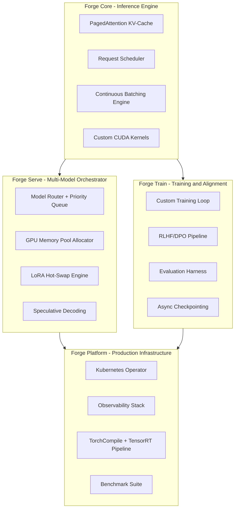

# Forge: Local GPU AI Infrastructure Platform — 12-Week Execution Plan

## Strategic Framing

This is NOT a single project — it is a **platform** comprising 4 interconnected subsystems, each mapping directly to an interview dimension at top AI firms. The platform tells a story: "I understand every layer from CUDA warps to Kubernetes operators, and I've built each one from scratch."

---

## Architecture Overview



---

## Month 1: Forge Core + Forge Serve (The Inference Mastery)

### Week 1: CUDA Foundations and Custom Kernels

**Goal**: Demonstrate you understand GPU architecture at the hardware level.

**Build**:
- Set up CUDA 12.x + PyTorch from source (not pip — build from source to understand the build system)
- Write 3 custom CUDA kernels using Triton (OpenAI's compiler):
  1. Fused RMSNorm + Residual addition (demonstrates kernel fusion)
  2. Custom RoPE (Rotary Position Embedding) implementation
  3. Online Softmax (the building block of FlashAttention)
- Write a pure CUDA C++ kernel (without Triton) for vector addition and matrix multiply to understand the raw programming model
- Build a micro-benchmarking harness that measures: FLOPS utilization, memory bandwidth, occupancy

**Key Concepts to Internalize**:
- Warp divergence, memory coalescing, shared memory bank conflicts
- SM occupancy calculator — understand why certain kernel configs are faster
- CUDA streams and async execution

**Deliverable**: `forge-kernels/` directory with benchmarked custom kernels + a README explaining GPU architecture decisions.

**Interview Signal**: "I wrote custom CUDA kernels and can explain why my fused RMSNorm achieves 85% of theoretical memory bandwidth."

---

### Week 2: The KV-Cache and PagedAttention (From Scratch)

**Goal**: Implement the core innovation that makes vLLM fast — but from first principles.

**Build**:
- Implement a block-based KV-cache manager:
  - Physical blocks (fixed-size GPU memory chunks)
  - Logical blocks (per-sequence virtual address space)
  - Block table mapping (like a page table in OS virtual memory)
- Implement copy-on-write for parallel sampling (beam search, top-k sampling)
- Implement cache eviction policies: LRU, priority-based, prefix-aware
- Build swap manager: GPU ↔ CPU memory migration for preempted sequences

**Key Concepts to Internalize**:
- Why PagedAttention eliminates memory fragmentation (internal + external)
- The analogy to OS virtual memory (and where it breaks down)
- Memory waste in naive KV-cache: reserved but unused memory per sequence

**Deliverable**: A standalone `forge-cache/` library with unit tests proving zero fragmentation under mixed-length sequences.

**Interview Signal**: "I can whiteboard PagedAttention's block table design and explain exactly why it achieves near-zero memory waste compared to static allocation."

---

### Week 3: Continuous Batching and Request Scheduling

**Goal**: Build the serving engine that handles concurrent requests efficiently.

**Build**:
- Implement iteration-level scheduling (not request-level):
  - In each forward pass, the batch can contain tokens from different sequences at different generation steps
- Build a priority-based scheduler:
  - First-come-first-served baseline
  - Shortest-remaining-first (for sequences near max_tokens)
  - Preemption policy: swap vs recompute tradeoff
- Implement prefix caching (for repeated system prompts)
- Build streaming token output with Server-Sent Events (SSE)

**Key Concepts to Internalize**:
- Why static batching wastes GPU cycles (short sequences pad, long sequences block)
- The scheduling problem as a variant of job scheduling with preemption
- How iteration-level scheduling achieves near-optimal GPU utilization

**Deliverable**: `forge-engine/` — a working inference server that serves Llama-3-8B (or Mistral 7B) with continuous batching. Benchmark against HuggingFace `generate()` showing 3-5x throughput improvement.

---

### Week 4: Multi-Model Orchestration and Memory Management

**Goal**: Solve the hard problem of serving multiple models on limited VRAM.

**Build**:
- GPU Memory Pool Allocator:
  - Pre-allocate VRAM into typed pools (KV-cache pool, weights pool, activation pool)
  - Implement fragmentation-aware allocation (best-fit, buddy system, or slab allocator)
  - Memory pressure detection and automatic eviction
- Model Router:
  - Load/unload models dynamically based on request traffic
  - Model priority queue with configurable policies
  - Warm/cold model states (weights in CPU RAM vs GPU VRAM vs disk)
- LoRA Adapter Hot-Swap:
  - Load base model once, swap LoRA adapters in <100ms
  - Concurrent adapter serving (multiple LoRAs on same base model)
- Speculative Decoding:
  - Draft model (small) generates N tokens, target model (large) verifies in one forward pass
  - Implement the acceptance/rejection sampling correctly

**Deliverable**: Demo serving 3 models (or 1 base + 5 LoRA adapters) on 16GB VRAM with intelligent scheduling. Sub-200ms model swap latency.

---

## Month 2: Forge Train + Advanced Optimization (The Training and Alignment Mastery)

### Week 5: Custom Training Loop and Distributed Concepts

**Goal**: Show you understand training infrastructure, not just inference.

**Build**:
- Custom training loop (NOT using HuggingFace Trainer — write it from scratch):
  - Mixed-precision training (FP16/BF16) with loss scaling
  - Gradient accumulation (simulate larger batch sizes)
  - Gradient checkpointing (trade compute for memory)
  - Learning rate schedulers (cosine with warmup, from scratch)
- Implement core distributed training concepts (simulated on single GPU):
  - Data parallelism with gradient AllReduce (simulate with multiple processes)
  - Understand tensor parallelism: column-parallel and row-parallel linear layers
  - Understand pipeline parallelism: micro-batching and bubble overhead
  - Implement FSDP-style sharding (conceptual implementation showing the communication pattern)

**Key Concepts to Internalize**:
- Ring AllReduce algorithm (implement it with torch.distributed on localhost)
- Why ZeRO-1/2/3 works (what's sharded at each stage)
- The memory equation: model params + gradients + optimizer states + activations
- Activation recomputation vs activation offloading tradeoff

**Deliverable**: Training script that fine-tunes a 7B model on your GPU using gradient checkpointing + mixed precision + gradient accumulation. A document showing the memory breakdown calculation.

---

### Week 6: RLHF and Alignment Infrastructure

**Goal**: This is THE differentiator for Anthropic/OpenAI. Show you understand alignment infrastructure.

**Build**:
- Implement the full RLHF pipeline from scratch (not using TRL's high-level API):
  1. SFT (Supervised Fine-Tuning) stage
  2. Reward Model training (Bradley-Terry preference model)
  3. PPO (Proximal Policy Optimization) training loop:
     - Reference model (frozen)
     - Policy model (being trained)
     - Reward model (scoring)
     - Value model (critic for advantage estimation)
     - KL penalty computation between policy and reference
- Implement DPO (Direct Preference Optimization) as an alternative:
  - Show why DPO eliminates the reward model
  - Compare training stability and compute requirements
- Build a simple evaluation pipeline:
  - Automated metrics (perplexity, BLEU, ROUGE)
  - LLM-as-judge evaluation
  - Human preference simulation

**Key Concepts to Internalize**:
- Why KL divergence penalty prevents reward hacking
- The reward model training objective (cross-entropy over preference pairs)
- PPO clipping and why it stabilizes training
- DPO's implicit reward model derivation

**Deliverable**: `forge-train/` with a working RLHF pipeline that aligns a small model (1-3B params) on a preference dataset. Published comparison of PPO vs DPO on your hardware.

---

### Week 7: Quantization Pipeline and Compiler Optimization

**Goal**: Demonstrate deep understanding of model optimization beyond "use 4-bit".

**Build**:
- Implement quantization methods from theory to code:
  - Post-Training Quantization (PTQ): Round-to-nearest, calibration-based
  - GPTQ: Understand the layer-wise Hessian-based approach
  - AWQ: Activation-aware weight quantization (protect salient weights)
  - Implement INT8 and INT4 quantization with custom dequantization kernels
- Build quality gates:
  - Perplexity measurement on calibration set before/after quantization
  - Task-specific benchmarks (MMLU, HellaSwag)
  - Automatic rejection if quality drops below threshold
- TensorRT-LLM Integration:
  - Build model → TensorRT compilation pipeline
  - Understand graph optimization passes (layer fusion, kernel auto-tuning)
  - Compare TensorRT vs torch.compile vs eager mode
- Triton compiler deep-dive:
  - Write an auto-tuning config for your custom kernels
  - Understand block sizes, num_warps, num_stages tuning

**Deliverable**: Automated pipeline that takes any HuggingFace model → quantizes it (multiple methods) → benchmarks quality/speed → selects optimal configuration. Published results with Pareto frontier charts (quality vs speed).

---

### Week 8: Evaluation Framework and Safety Infrastructure

**Goal**: Show you think about model quality and safety systematically (critical for Anthropic).

**Build**:
- Comprehensive evaluation harness:
  - Standard benchmarks: MMLU, HumanEval, GSM8K, HellaSwag
  - Custom eval tasks with few-shot prompting
  - Statistical significance testing (bootstrap confidence intervals)
- Safety evaluation:
  - Toxicity detection pipeline
  - Refusal evaluation (does the model refuse harmful requests?)
  - Jailbreak resistance testing
- A/B testing infrastructure:
  - Route percentage of traffic to model variants
  - Collect preference signals
  - Statistical comparison framework

**Deliverable**: `forge-eval/` — a reusable evaluation framework that can benchmark any model on safety and capability dimensions.

---

## Month 3: Forge Platform (The Production Engineering Mastery)

### Week 9: Kubernetes Operator for GPU Workloads

**Goal**: This is what separates senior engineers from staff engineers — building the control plane.

**Build** (in Python using `kopf` or in Go using `controller-runtime`):
- Custom Resource Definitions (CRDs):
  - `InferenceService`: Defines a model to serve (model path, resource limits, scaling policy)
  - `ModelCache`: Manages model artifacts on nodes
  - `GPUPool`: Represents available GPU resources
- Operator logic:
  - Watch for InferenceService CRDs → create/update/delete serving pods
  - Implement GPU bin-packing (fit multiple small models on one GPU)
  - Health checking with automatic restart on OOM
  - Horizontal scaling based on request queue depth
  - Rolling updates with zero-downtime model swaps
- Deploy on K3s (lightweight Kubernetes — skip the minikube overhead)

**Key Concepts to Internalize**:
- Reconciliation loop pattern (desired state vs actual state)
- Kubernetes informers and work queues
- Leader election for HA operators
- Finalizers for cleanup

**Deliverable**: `forge-operator/` — a working K8s operator that manages GPU inference workloads. Demo video showing: deploy model → auto-scale → rolling update → handle GPU OOM gracefully.

---

### Week 10: Observability and Production Debugging

**Goal**: Prove you can operate systems, not just build them.

**Build**:
- Custom metrics exporter (Prometheus):
  - GPU utilization per-model (not just nvidia-smi — per-kernel attribution)
  - KV-cache hit rate, eviction rate, fragmentation percentage
  - Request latency breakdown: queue time, prefill time, decode time, network time
  - Token throughput: tokens/sec at p50, p95, p99
  - Memory allocation patterns over time
- Distributed tracing (OpenTelemetry):
  - Trace a request from HTTP arrival → tokenization → scheduling → inference → streaming response
  - Span attributes: batch size, sequence length, cache hits
- Grafana dashboards:
  - Real-time GPU memory waterfall
  - Request SLO compliance (% requests under target latency)
  - Model comparison dashboard
- Alerting rules:
  - KV-cache fragmentation > 20%
  - p99 latency exceeds SLO
  - GPU memory pressure (approaching OOM)
- Debugging toolkit:
  - GPU memory profiler (where is VRAM being consumed?)
  - Request replay for debugging (capture and replay problematic requests)
  - Flame graphs for CUDA kernel time attribution

**Deliverable**: Full observability stack with Grafana dashboards. A recorded debugging session showing how you identify and fix a latency regression.

---

### Week 11: Networking, Protocol Design, and API Layer

**Goal**: Show you understand the data plane, not just the compute plane.

**Build**:
- Dual-protocol serving:
  - gRPC for internal service-to-service (with protobuf schema)
  - HTTP/2 + SSE for client-facing streaming
  - OpenAI-compatible API (drop-in replacement)
- Connection management:
  - Request queuing with backpressure
  - Circuit breaker pattern for model failures
  - Rate limiting with token bucket algorithm
  - Request routing with weighted load balancing
- Efficient serialization:
  - Custom tensor serialization (avoid pickle — use safetensors format)
  - Zero-copy transfer between processes where possible
- Client SDK:
  - Python client with async support
  - Streaming iterator pattern for token-by-token consumption
  - Retry logic with exponential backoff

**Deliverable**: Production-quality API layer with OpenAI compatibility, documented with OpenAPI spec.

---

### Week 12: Documentation, Benchmarks, and Portfolio Polish

**Goal**: Transform engineering work into an undeniable portfolio asset.

**Build**:
- Technical blog series (5-6 posts):
  1. "Building PagedAttention from Scratch: GPU Memory as a Virtual Memory System"
  2. "Writing CUDA Kernels with Triton: From Online Softmax to FlashAttention"
  3. "Why Your Inference Server is Slow: A Deep Dive into Continuous Batching"
  4. "RLHF from Scratch: The Engineering Behind Alignment"
  5. "Building a Kubernetes Operator for GPU Workloads"
  6. "Quantization is Not Magic: The Math Behind INT4 Inference"
- Comprehensive benchmark report:
  - Forge vs vLLM vs TGI vs Ollama on identical hardware
  - Latency, throughput, memory efficiency, time-to-first-token
  - Different model sizes, batch sizes, sequence lengths
  - Published as reproducible notebooks
- Architecture Decision Records (ADRs):
  - One ADR per major design decision (10-15 total)
  - Format: Context → Decision → Consequences → Alternatives Considered
- System design document:
  - Full architecture diagram with data flow
  - Failure modes and recovery strategies
  - Capacity planning calculations
- README that tells a story:
  - Problem statement → Architecture → Results → Reproduction steps
  - Badges: CI passing, benchmark results, documentation coverage
- Demo video (5-7 minutes):
  - Show the system under load
  - Show monitoring and debugging
  - Show model hot-swap
  - Show the Kubernetes operator in action

---

## The Meta-Skills This Builds (Mapped to Interview Rounds)

| Interview Round | What They Test | Where You Built It |
|---|---|---|
| Systems Design | Design a serving system at scale | Weeks 1-4, 9, 11 |
| CUDA/Low-Level | GPU programming, memory models | Weeks 1-2, 7 |
| ML Depth | Transformers, training, alignment | Weeks 5-6, 8 |
| Distributed Systems | Parallelism, fault tolerance | Week 5, 9-10 |
| Production Eng | Observability, debugging, reliability | Weeks 9-11 |
| Coding | Systems-level implementation | Every single week |
| Communication | Explain complex tradeoffs clearly | Week 12 (blog + ADRs) |

---

## Daily Rhythm (Non-Negotiable)

- **Morning (2 hours)**: Study theory — read the actual papers (vLLM, FlashAttention, RLHF, DPO, PagedAttention)
- **Afternoon (4-5 hours)**: Build — write code, run experiments, debug
- **Evening (1 hour)**: Document — write ADRs, update blog drafts, commit clean code
- **Weekly**: One benchmark comparison, one blog post draft, one architecture diagram

---

## Reading List (The Papers You Must Internalize)

1. "Efficient Memory Management for Large Language Model Serving with PagedAttention" (vLLM paper)
2. "FlashAttention: Fast and Memory-Efficient Exact Attention" (Dao et al.)
3. "FlashAttention-2: Faster Attention with Better Parallelism and Work Partitioning"
4. "Training language models to follow instructions with human feedback" (InstructGPT/RLHF)
5. "Direct Preference Optimization" (DPO paper)
6. "GPTQ: Accurate Post-Training Quantization for Generative Pre-Trained Transformers"
7. "AWQ: Activation-aware Weight Quantization"
8. "Megatron-LM: Training Multi-Billion Parameter Language Models Using Model Parallelism"
9. "ZeRO: Memory Optimizations Toward Training Trillion Parameter Models"
10. "Orca: A Distributed Serving System for Transformer-Based Generative Models" (continuous batching origin)
11. "Efficiently Scaling Transformer Inference" (Google, on model parallelism for inference)
12. "Speculative Decoding" (Leviathan et al.)

---

## Success Criteria (How You Know You're Ready)

- [ ] Can whiteboard PagedAttention from memory and explain memory savings mathematically
- [ ] Can write a CUDA kernel without looking up syntax
- [ ] Can explain Ring AllReduce, tensor parallelism, and pipeline parallelism with diagrams
- [ ] Can derive the DPO loss function from the RLHF objective
- [ ] Can explain why FlashAttention is IO-aware and calculate the memory hierarchy tradeoff
- [ ] Can design a model serving system at 100K QPS on a whiteboard in 45 minutes
- [ ] Can debug GPU OOM issues systematically (memory profiling, fragmentation analysis)
- [ ] Can explain your Kubernetes operator's reconciliation loop and failure recovery
- [ ] Have published benchmarks with statistical rigor (confidence intervals, not single runs)
- [ ] Can explain every architectural decision in your system with alternatives you considered

---

## The Repository Structure

```
forge/
├── README.md                          # The story
├── docs/
│   ├── architecture.md                # System design document
│   ├── adrs/                          # Architecture Decision Records
│   └── blog/                          # Technical blog posts
├── forge-kernels/                     # Custom CUDA/Triton kernels
│   ├── triton/                        # Triton kernel implementations
│   ├── cuda/                          # Raw CUDA C++ kernels
│   └── benchmarks/                    # Kernel micro-benchmarks
├── forge-cache/                       # PagedAttention KV-cache library
├── forge-engine/                      # Core inference engine
│   ├── scheduler/                     # Request scheduling
│   ├── batch/                         # Continuous batching
│   └── memory/                        # GPU memory pool allocator
├── forge-serve/                       # Multi-model orchestration
│   ├── router/                        # Model routing + load balancing
│   ├── lora/                          # LoRA hot-swap engine
│   └── speculative/                   # Speculative decoding
├── forge-train/                       # Training infrastructure
│   ├── loop/                          # Custom training loop
│   ├── rlhf/                          # RLHF/DPO pipeline
│   └── distributed/                   # Distributed training concepts
├── forge-eval/                        # Evaluation framework
├── forge-quant/                       # Quantization pipeline
├── forge-operator/                    # Kubernetes operator
├── forge-observe/                     # Observability (metrics, tracing, dashboards)
├── forge-api/                         # gRPC + HTTP API layer
├── benchmarks/                        # End-to-end benchmark suite
│   ├── results/                       # Published results with charts
│   └── notebooks/                     # Reproducible Jupyter notebooks
├── deploy/                            # K3s manifests, Docker configs
├── tests/                             # Comprehensive test suite
└── pyproject.toml                     # Proper Python packaging
```
